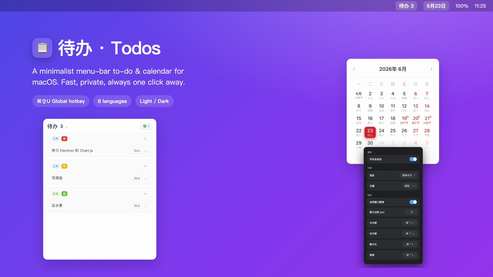
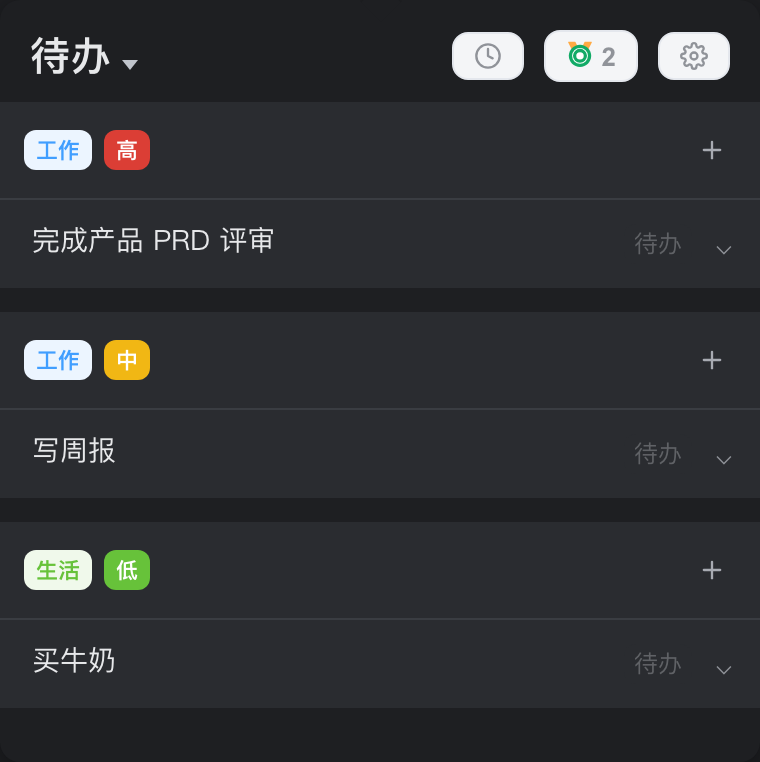
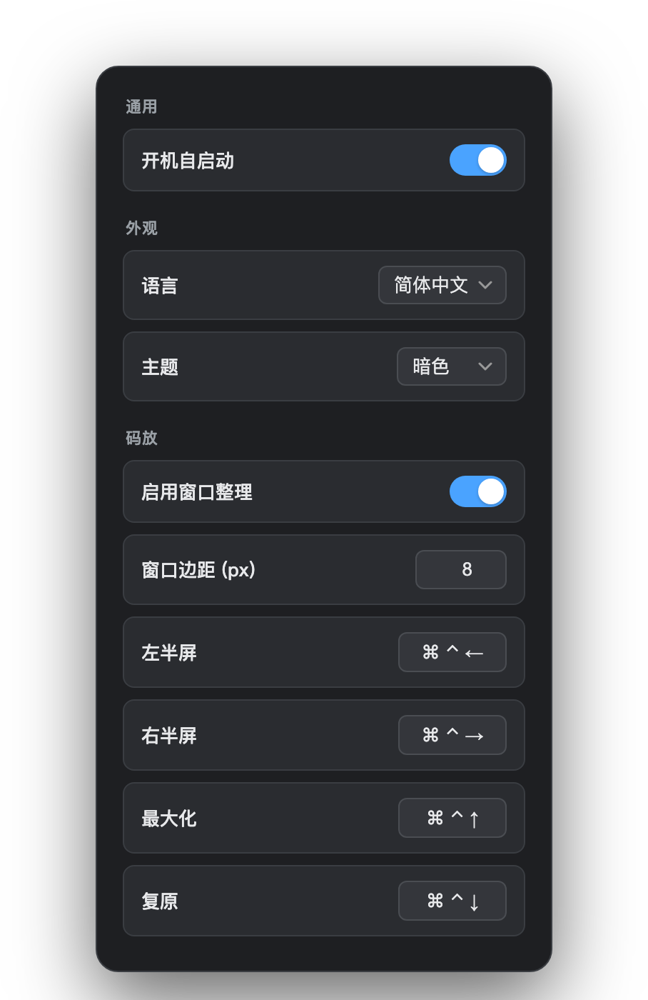

<div align="center">



# 待办 · Todos

**一款常驻 macOS 菜单栏的待办与日历 —— 轻快、私密、随手可达。**

[](https://www.apple.com/macos/)
[](https://tauri.app/)
[](https://www.rust-lang.org/)
[](#-为什么选-tauri)
[](LICENSE)

[English](README.md) · 简体中文

</div>

---

**待办 · Todos** 常驻在 macOS 菜单栏：左键点击托盘图标，待办清单就在图标正下方弹出；第二个托盘图标显示今天日期，点开是带农历的日历。没有 Dock 图标、不占窗口，需要时一键唤出，全局快捷键随处可用。

它最初是 Electron 应用，现已用 **Tauri v2** 重写：安装包从 ~100MB 缩到 **~1.8MB 的 .dmg**，常驻内存大幅下降，使用原生 macOS WebView。

## ✨ 功能特性

- 🧷 **菜单栏原生** —— 两个托盘图标（待办 + 日历）。左键在图标正下方弹窗，右键打开菜单；不在 Dock 显示（accessory 应用）。
- ✅ **顺手的待办** —— 按分类 / 优先级 / 时间分组，行内编辑，一键切换状态，并有带完成趋势图的「成就」视图。
- 🍅 **内置番茄钟** —— 把任意任务变成专注计时；胶囊计时器可悬浮在全屏 App 之上。
- 📅 **带农历的日历** —— 公历 + 农历、法定节假日与「休 / 班」角标，高亮今天。
- ⌨️ **全局快捷键** —— `⌘ ⇧ U` 在任意 App 下唤出/收起清单。
- 🌗 **亮色 / 暗色 / 跟随系统** —— 即时切换，所有窗口同步。
- 🌍 **8 种语言** —— 简体中文、English、日本語、한국어、Español、Français、Deutsch、Русский，连托盘文案与菜单也会本地化。
- 🚀 **开机自启动** —— 可选，设置里一个开关。
- 🪟 **窗口分屏** —— 把**任意 App 的当前活跃窗口**分到左半屏 / 右半屏 / 铺满，或一键复原；快捷键**可自定义**（默认 `⌘⌃ + 方向键`），边距可调。需要 macOS「辅助功能」权限。
- ☁️ **隐私优先** —— 数据是存在你自己 iCloud Drive 里的纯 JSON，无账号、无遥测、无服务器。

## 📸 界面预览

|                       待办                        |                       日历                         |
| :-------------------------------------------------: | :----------------------------------------------------: |
|  |  |

|                     暗色模式                      |                       设置                        |
| :------------------------------------------------: | :---------------------------------------------------: |
|  |  |

## 📦 安装

### 下载

在 [Releases](../../releases) 页面下载最新 `.dmg`，打开后把 **待办.app** 拖到「应用程序」。

> 应用尚未公证（notarize）。首次打开请右键 App →「打开」，或在 *系统设置 → 隐私与安全性* 里允许运行。

### 从源码构建

```bash
# 前置：Rust (https://rustup.rs) 与 Tauri CLI
cargo install tauri-cli --version "^2.0"

git clone https://github.com/<polimao>/todos.git
cd todos
cargo tauri build      # 中文版 → 软件名「日行」

# 国际版 → 软件名 "RiXing"
cargo tauri build --config src-tauri/tauri.international.conf.json

# 两者产物都在 src-tauri/target/release/bundle/{dmg,macos}/
```

> 两个版本都内置全部 8 种界面语言并按系统自动切换，区别仅在软件名（`日行` vs
> `RiXing`）。官网（[`docs/`](docs/)）会在中国（按时区）默认显示中文 + `日行` 安装包，
> 其它地区按访客语言显示 + `RiXing` 安装包，导航栏另有手动切换语言的下拉框。

## 🚀 使用

| 操作                         | 方式                                       |
| ---------------------------- | ------------------------------------------ |
| 显示 / 隐藏待办清单          | 左键点击 **待办** 托盘图标，或按 `⌘ ⇧ U`   |
| 打开日历                     | 左键点击 **日期** 托盘图标                 |
| 打开设置 / 退出              | 右键点击任一托盘图标                       |
| 切换语言 / 主题 / 开机自启动 | **设置** 窗口                              |

## ⚙️ 设置

右键托盘图标 →「设置」：

- **开机自启动** —— 登录时自动启动「待办」。
- **语言** —— 8 种语言，或*跟随系统*。
- **主题** —— 亮色、暗色，或*跟随系统*。
- **窗口分屏** —— 开启后可设置窗口**边距**，并**重绑**每个快捷键（点一下按键框再按下组合键）。首次开启会弹出 macOS「辅助功能」授权。

改动会即时应用到所有窗口与菜单栏文案。

### 窗口分屏 快捷键（默认）

| 快捷键   | 动作                     |
| -------- | ------------------------ |
| `⌘ ⌃ ←`  | 移到当前屏幕左半部分     |
| `⌘ ⌃ →`  | 移到右半部分             |
| `⌘ ⌃ ↑`  | 最大化（铺满屏幕）       |
| `⌘ ⌃ ↓`  | 复原到之前的窗口大小     |

四个都可由用户自改，**边距**是所有分屏尺寸的前提。

## 🛠 开发

前端是纯静态 HTML/CSS/JS（无打包步骤），后端是 Rust。

```bash
cargo tauri dev        # 运行（Rust 侧热重载）
# 或：pnpm dev / pnpm build（即上面两条命令的别名）
```

```
src/                       前端（Tauri frontendDist，纯静态、无打包步骤）
  index.html  renderer.js  style.css      待办窗口
  calendar.html  calendar.js              日历窗口（农历由 vendored 的 lunar.js 提供）
  settings.html  settings.js              设置窗口
  i18n.js                                 8 语言词典与工具函数
  ui-common.js                            主题 + 语言引导、跨窗口同步
  theme.css                               CSS 变量 + 暗色覆盖
src-tauri/                 Rust 后端
  src/main.rs              窗口 / 托盘 / 快捷键 / 番茄钟 / 存储 / 国际化
  tauri.conf.json          无边框 + 透明 + 菜单栏代理
  capabilities/            前端 IPC 能力
```

### 实现要点

- **托盘本地化** —— 每个图标一个 `TrayIconBuilder`；标题、菜单（设置 / 退出）与日期格式都按所选语言本地化。切换语言会在主线程重建托盘。
- **国际化** —— `i18n.js` 存词典；`ui-common.js` 解析语言（显式或跟随系统），翻译 `[data-i18n]` 节点，并通过 Tauri 事件同步所有窗口。
- **主题** —— `<html>` 上的 `data-theme` 驱动 CSS 变量；「跟随系统」用 `prefers-color-scheme` 解析。
- **失焦自动隐藏与定位** —— 窗口失焦自动隐藏（番茄钟时除外），并在被点击的托盘图标正下方居中弹出。

## 🪶 为什么选 Tauri

|              | Electron（旧）   | **Tauri v2（现在）** |
| ------------ | ---------------- | -------------------- |
| `.dmg` 体积  | ~100 MB          | **~1.8 MB**          |
| 运行时       | 内置 Chromium    | 原生 macOS WebView   |
| 常驻内存     | 高               | 大幅降低             |
| 后端         | Node             | Rust                 |

## 🔒 数据与隐私

一切都留在你的电脑上。待办与设置以 JSON 存储：**开启 iCloud Drive 时**放在 iCloud Drive（多台 Mac 自动同步），**未开启时**退回本地 App Support：

```
# iCloud Drive 已开启：
~/Library/Mobile Documents/com~apple~CloudDocs/Todos/.todos_data.json
~/Library/Mobile Documents/com~apple~CloudDocs/Todos/.todos_settings.json
# 未开启 iCloud Drive 时：
~/Library/Application Support/com.limao.todos/.todos_data.json
~/Library/Application Support/com.limao.todos/.todos_settings.json
```

无账号、无统计、无任何网络请求。（旧版 `~/.todos_*.json` 会在首次启动时自动迁移并删除。）

## 🗺 路线图

- [ ] 公证 / 签名构建
- [ ] 提醒与通知
- [ ] 应用内内容的更深层本地化
- [ ] Windows / Linux 构建

## 🤝 参与贡献

欢迎提 Issue 和 PR。较大的改动请先开 Issue 讨论。

## 📄 许可证

[MIT](LICENSE) © 李貌
